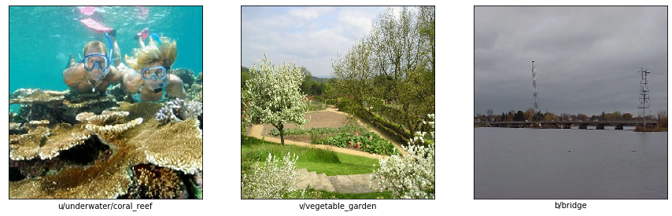

# ProjectDL1-classification
## About
The goal of this project is solving a classification problem on the [SUN397](https://vision.cs.princeton.edu/projects/2010/SUN/) dataset. It consists of 108,754 images divided into 397 categories. Each image represents a scene to be categorized.



## Usage
### Training
To train a model run
```shell script
python train.py --config [path to configuration file]
```
Optional arguments can be provided:
* `--save-checkpoint [path]` to specify a location to save model parameters after training. If not provided model parameters will not be saved
* `--load-checkpoint [path]` to specify model parameters to load. If not provided model will be initialized with random parameters

Both options can also be specified in the configuration file

### Evaluation
To evaluate a model on the test dataset run
```shell script
python evaluate.py --config [path to configuration file] --load-checkpoint [path to model parameters]
```

### Downloading data
A script to download image data is provided. To use it run
```shell script
scripts/download.sh [location]
```

Location can be omitted, in which case data will be extracted to the "data" directory

## Models
The following architectures were considered so far:
* Deep neural networks:
1. DeepModel: a deep neural network with adjustable layer output sizes
* Convolutional neural networks:
1. SimpleConvModel: a scaled-down version of the VGG architecture
##Results
| Model | Hyperparameters | Test accuracy |
|------------|---------------|----------|
| DeepModel, hidden layers: 1024, 1024 | learning rate: 0.001 | | 
| SimpleConvModel | learning rate: 0.001, no l2 regularization | |
| SimpleConvModel | learning rate: 0.001, l2 regularization: 0.001 |